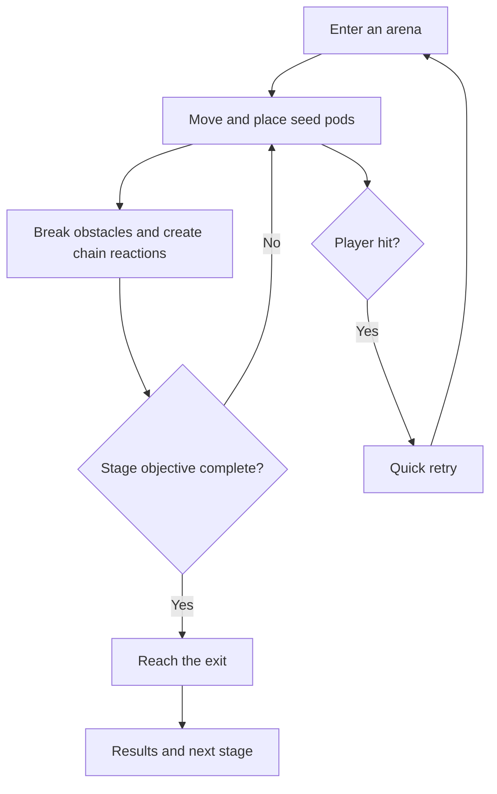
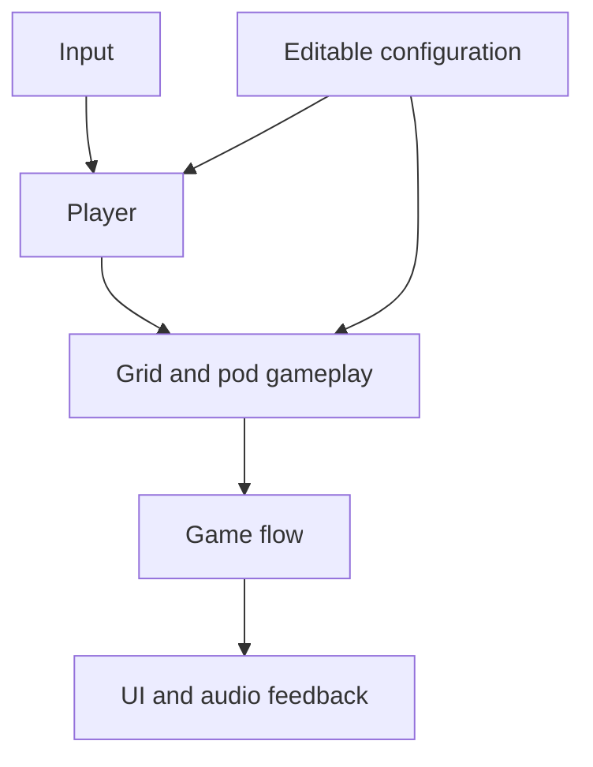

# BomberBird

## Game Design Document

| Field | Value |
|---|---|
| Status | Approved by the lecturer through the designated course GDD Google Sheet |
| Team | Roy Davidovich, game design and development |
| Genre | Single-player top-down grid action-puzzle |
| Target platform | Desktop: Windows PC and macOS |
| Engine | Unity 6.3 LTS, 6000.3.21f1, 2D |
| Display | Landscape, 1920 x 1080 reference resolution |
| Expected session length | A few minutes per stage |
| Submission deadline | 4 October 2026 |
| Document version | v0.21, 2026-09-25 |

## 1. High Concept

BomberBird is a single-player action-puzzle game inspired by Bomberman. The player controls an Israeli bird defending local habitats from invasive common mynas in grid arenas, using timed seed pods that burst in four directions to clear obstacles, defeat enemies, and reach the exit. Each stage may also contain an optional bird rescue that rewards exploration without blocking progress.

### Design Pillars

1. **Readable chain reactions**: attacks follow simple grid, timing, and blocking rules.
2. **Israeli bird identity**: local birds defend recognizable habitats from invasive common mynas, giving the classic formula a distinct theme.
3. **Short handmade challenges**: every arena has a clear goal, quick retries, and room for playful level ideas.

## 2. Reference and Inspiration


- **Primary reference:** [Super Bomberman R](https://www.konami.com/games/asia/en/products/bomberman_r/).
- **Video:** [Official Konami gameplay trailer](https://www.youtube.com/watch?v=ZMuRtNADbpA).
- **Taking:** grid arenas, timed placement, cross-shaped attacks, destructible obstacles, and chain reactions.
- **Changing:** a single-player focus, Israeli birds defending local habitats from common mynas, original art, and seed-and-wind effects instead of traditional bombs.
- **Not taking:** Bomberman characters, assets, levels, competitive multiplayer, online systems, or a stage editor.

### Visual Direction

The intended style is colorful, readable, and viewed from above. Different stages can draw inspiration from Israeli environments such as wetlands, coast, desert, or urban gardens. Common mynas are the enemy birds and must remain visually distinct from playable and rescued birds. The exact art style, playable bird roster, palette, and effects will be explored during prototyping rather than fixed by this document.

## 3. Core Game Loop



### Moment-to-Moment Rules

- The bird moves in four directions through open corridors.
- The player places a timed seed pod on the grid.
- The pod bursts outward in four directions.
- Solid objects stop the burst. Some obstacles can be destroyed.
- A burst can trigger another pod and create a chain reaction.
- Common mynas act as the enemy birds. Their exact movement behavior will be selected during prototyping.
- The player loses a life when hit by a common myna, another hazard, or a burst that catches them as it goes off, then retries the stage immediately. Flames still fading after a burst are scenery and harm nobody but the mynas, so a player who has watched a burst end can cross it. Common mynas remain vulnerable to those flames for as long as they are drawn. Spending the last life ends the attempt rather than the run: a GAME OVER card says so, and the player chooses between another try at the same stage, with the stage reached and the birds earned intact, and returning to the menu. Six stages have to be completable in one sitting.
- The stage objective is to defeat every common myna in the arena.
- On a regular stage, a new bird's feather sits locked inside a cage from the moment the stage begins, so the player can see the reward and the bars around it for the whole level. The cage is solid: it blocks movement and stops bursts, and no amount of firepower opens it. It says so when tried: a burst that reaches it clanks and shakes it, the first such burst of a run adds "Pods can't break it - clear the mynas" over it, and the first cage stage of a run states the rule over the cage while the stage waits to begin.
- Defeating the last myna opens the cage. The player then walks over the feather to collect it, and only then does the exit open.
- A stage carries a cage if and only if it awards a bird. The intro stage, the orchard stage, and the boss stage award no feather and carry no cage, so defeating the last myna opens their exit directly.
- The exit is a gate set in the middle of the arena's right-hand wall, in the same place on every stage, so the player learns where the way out is once. It stands visibly shut until the stage is finished with them.
- When the gate opens, a bright arrow flashes beside it. Walking into the gate completes the stage.
- An optional rescue may provide an additional stage reward.

### Progress and Scoring

A stage is complete when its main objective is cleared and the player reaches the exit. Optional goals, such as finding a rescued bird or meeting a time target, may award additional feathers. The precise rating rules will be tested during development and will not block basic progression.

### Campaign and Unlocks

The campaign is six handmade levels. Each level is themed around one bird and set in the habitat that bird belongs to, so every stage has its own visual identity rather than reskinning a single arena.

| Level | Habitat | Themed around |
|---|---|---|
| 1. Intro | Garden | Eurasian hoopoe, the starting bird |
| 2. Orchard | Orchard grove | Eurasian hoopoe |
| 3. Stream | Stream bank | White-throated kingfisher |
| 4. Lagoon | Lagoon shore | Great white pelican |
| 5. Upland | Rocky upland | Chukar partridge |
| 6. Boss | Overgrown courtyard | Common myna, as the boss |

A level that introduces a new bird drops that bird's feather into the arena once the last myna is defeated. Collecting it opens the exit and makes the bird playable from that point on. The player carries the growing roster forward and chooses from it at the start of later levels.

Four birds are playable: the Eurasian hoopoe, the white-throated kingfisher, the great white pelican, and the chukar partridge. The player starts as the hoopoe, so the intro level teaches the core rules with a character already in hand. The common myna is the enemy species and the final boss, and is never playable.

Three birds are unlocked across six levels, so three levels award no feather. Two of them are fixed by the design: the intro teaches the rules, and the boss ends the campaign. The third is the orchard, because it is the second hoopoe stage and introduces no new bird - it raises the difficulty while the player is still learning the starter. The feather found in a habitat is therefore always that habitat's own bird: the kingfisher on the stream bank, the pelican on the lagoon shore, the chukar in the rocky upland.

The rule above holds regardless: a bird becomes playable by being discovered inside a level, never by being available from the start.

### Parameters to Tune

| Parameter | What it controls | Scope | First guess |
|---|---|---|---|
| Movement speed | Responsiveness and navigation | Per bird | See the roster table below |
| Burst range | Area affected in each direction | Per bird | See the roster table below |
| Active pod limit | Number of simultaneous placed pods | Per bird | See the roster table below |
| Fuse duration | Time available to escape or prepare a chain | Shared | 2 seconds |
| Starting lives | Attempts before the run ends | Shared | 6 |
| Enemy speed | Pressure inside the arena | Shared | 2.0, halved by the menu's mynas toggle |

These values will be editable in the Unity Inspector or a configuration asset.

#### How the birds differ

The four playable birds share every rule. They differ only in the three tuned values
above, carried on a per-bird configuration asset, so the roster the player has earned
changes how a stage is approached without any bird needing rules of its own. This
keeps the design clear of the "unique rule sets for every bird" exclusion in section
8.3, and makes the feather unlock a mechanical reward rather than a costume.

| Bird | Movement speed | Burst range | Active pods | Intended feel |
|---|---|---|---|---|
| Eurasian hoopoe | 4.0 | 2 | 1 | The starter. Balanced, and the baseline the others are read against |
| White-throated kingfisher | 5.5 | 1 | 2 | Fast and nimble, and carries two pods, but has to place them close to what it wants to hit |
| Great white pelican | 3.0 | 3 | 1 | Slow and deliberate, with reach that clears a corridor at once |
| Chukar partridge | 4.5 | 2 | 2 | Brisk, and holds two pods with the burst range to use them |

These numbers are first guesses to be settled by playtest, not balance decisions. The
requirement they encode is that a player should feel the difference within one stage
of switching bird.

**Feel target:** a first-time player should understand the basic seed-pod interaction within the first stage and feel that failures were readable and avoidable.

## 4. Controls and Input

| Action | Keyboard | Gamepad | Touch |
|---|---|---|---|
| Move | WASD or arrow keys | Left stick or D-pad | Not planned |
| Place seed pod | Space | Main action button | Not planned |
| Confirm or retry | Enter or Space | Main action button | Not planned |
| Pause or back | Escape | Start or back button | Not planned |

Gameplay input is disabled while paused and during stage transitions. Losing focus pauses the game. Keyboard support is required; gamepad support is polish if time allows.

## 5. Screens and UI

1. **Main menu:** title art, Play, Difficulty, and Quit. Difficulty opens a panel rather than changing anything itself: a slider with the easiest flock on the left, the bird standing for each setting riding the lever, and each setting named under its own notch. The easier flock is slower and mostly holds its line through a junction rather than choosing afresh at each one. The choice is remembered between sittings.
2. **Bird selection:** the birds unlocked so far, each showing the three values that make it different, and Continue. It is skipped while the roster holds a single bird, because a screen offering one option is not a choice.
3. **Habitat screen:** a full screen before each stage, carrying art of the habitat, its name, two lines on what the place is, and the bird it belongs to. Shown on arriving at a stage, not on retrying one: a player on their fifth attempt at the upland is not there to be told what an upland is. The intro and the orchard both name the hoopoe; the courtyard is the one the myna has taken rather than one it is home to.
4. **Gameplay:** the arena in the right two-thirds of the screen, and in the left third a HUD drawn as an old olive tree: the habitat seen through its canopy, the stage and habitat named on a sign hanging from its branch, and the lives and the pods available to place held in hollows down its trunk. A lost life leaves its hollow empty. A pod is spent when placed and returns to the player when it bursts, so the count refills on its own.
5. **Pause overlay:** Resume, Restart, and Main Menu, with a lifebuoy in the panel's top corner that reopens How to play. An icon rather than a fourth entry: the three entries are things the player came to the menu to do, and the rules are a thing they may want while they are there.
5a. **How to play:** the rules, over the arena they apply to. Three frames cut from the game itself - walking, a pod placed, the burst - with the objective under them. Shown once a run as the intro stage opens, and again whenever it is asked for from the pause overlay. It is the same panel both times, so the rules cannot drift into two versions. Showing it over the loaded arena is the point: every word has the thing it names on screen behind it.
6. **Results:** shown when a stage ends. On a clear it names the stage and habitat, the bird flown, the feather if one was earned, and what the stage cost: mynas defeated, pods placed and time taken. It offers Next Stage and Retry, and on the final stage it carries the campaign totals before handing over to the closing screens. On the last life it becomes GAME OVER, offering Retry and Main Menu.
7. **Closing screen:** shown when the boss falls, in two beats. First the valley handed back, "The valley is yours again", with feathers thrown in from both sides and a short triumphant theme played once; then the birds the player rescued across the campaign, as the ending track begins. Each beat, and the turn to the closing note, fades through black to the next, the same as a change of screen.
8. **Closing note:** a factual card on the common myna as a real invasive species in Israel - not a footnote but the reason the game exists. It states what the species has actually cost local wildlife: native cavity-nesting birds evicted from their nests, eggs and chicks destroyed, and species pushed out of habitats they held before the myna arrived. The consequences are real and ongoing, and the card says so plainly, with its source credited.

Screens 1, 3, 7, and 8 exist to make six arenas read as one journey through Israeli
habitats. They carry no gameplay rules: removing all of them would leave the campaign
fully playable, which is the separation section 7 requires of presentation.

```text
+-----------------+----------------------------------+
|  canopy framing |                                  |
|  the habitat    |                                  |
|  [STAGE / name] |          GAMEPLAY ARENA          |
|  lives: 2 x 3   |                                  |
|  pods           |                                  |
+-----------------+----------------------------------+
   left third              right two-thirds
```

The camera sizes itself from the arena's own cells and fits the whole arena into the right two-thirds on any screen, so a wider screen shows more of the backdrop around it, never more of the game. The Canvas will scale from a 1920 x 1080 reference resolution, and important information will not rely on color alone.

## 6. Art and Audio

| Asset group | Planned approach | License plan |
|---|---|---|
| Birds and portraits | Original or clearly licensed 2D art | Record creator, source, and license |
| Environments and obstacles | Original or clearly licensed tile art | Record creator, source, and license |
| Effects and UI | Original or clearly licensed assets | Record creator, source, and license |
| Sound and music | Original or clearly licensed audio | Record creator, source, and license |

Birds should be recognizable at gameplay scale. The approved playable roster is the Eurasian hoopoe, great white pelican, chukar partridge, and white-throated kingfisher. Their approved retro pixel-art concept sheets are stored in `Docs/ArtReferences/Birds/`. The common myna is the designated enemy species because it is an invasive species whose growing presence in Israel supports the game's local habitat-defense theme. The approved myna concept sheet represents the regular enemy. A larger boss myna closes the campaign in level 6. It is the same species as the regular
enemy and moves by the same rules, but it survives five bursts instead of one, and the
stage begins with the boss alone so the player reads it before the arena fills. Each
non-fatal hit turns it a full circle on the spot, makes it slightly faster, and calls in
one more ordinary myna than the hit before - one, then two, three, and four, so ten
across the fight. The speed gain is capped, because the growing escort is the escalation
and a boss that accelerates unchecked stops being catchable. The fifth hit kills it and
calls nobody, and every slave still standing scatters and dies with it, harmless to the
player as it flees, so the arena empties on the blow that ends the fight rather than
peaking there. The boss arena is two cells wider than the others to give all of this room.
It has no attack of its own beyond touching the player, which every myna already does.
This keeps the campaign's climax inside systems that already exist rather than adding a
behaviour system in the final weeks. Ghost enemies are not part of the design. Other hazards, if used, will have fictional or abstract designs.

All imported assets will be listed in `Docs/ASSET_CREDITS.md` before submission. Art format, animation counts, and audio style will be chosen after a small visual prototype proves what is practical.

## 7. Technical Design

**Scenes:** five. A menu scene, a bird selection scene, a habitat screen, one reusable gameplay scene that every stage is loaded into, and a closing scene carrying both end cards. Selection and the habitat screen are their own scenes because the gameplay scene applies the chosen bird as it loads, so both have to come before the arena exists. The How to play panel is not a scene: it lives in the gameplay scene so the pause overlay can reopen it without unloading the stage.

**Systems:** Unity 2D, the built-in Input Manager, grid-based level data, and inspector-editable tuning values.

**Target device:** desktop computers running Windows or macOS. The game is developed and played on a Mac, so macOS is the primary test platform and the machine used for the class demonstration. A Windows build is produced and smoke-tested before submission so that both declared platforms actually run. Nothing in the design depends on a platform-specific API, so the two targets differ only by build settings.



| Component | Responsibility |
|---|---|
| Game flow | Manage playing, pause, success, failure, and restart |
| Player | Movement and pod placement |
| Grid gameplay | Occupancy, bursts, obstacles, and chain reactions |
| Level data | Describe a handmade arena and its objective |
| UI and audio | Present feedback without deciding gameplay rules |

The exact class names and boundaries will be chosen while building the first vertical slice.

### Course Features

1. **Coroutine:** handle pod fuse timing and short transitions because both are time-based sequences.
2. **Object pool:** reuse the burst effect objects. Every detonation previously built and
   destroyed a set of GameObjects, and chain reactions made that repeat in bursts, which is
   the repeated-spawning case this was reserved for. Built: the burst pieces and the one-shot
   stage effects are now drawn from a pool.
3. **Events:** notify UI and audio about gameplay changes without coupling them directly to the player.
4. **ScriptableObject or serialized configuration:** expose values that need playtesting without recompiling code.

Only features that improve the actual implementation will remain. The architecture may change when the prototype provides better evidence.

## 8. Scope

### 8.1 MVP

- [x] One complete loop from menu to playable stage, result, and retry.
- [x] Four-direction movement in a grid arena.
- [x] Timed pods, cross-shaped bursts, obstacles, and chain reactions.
- [x] At least one clear common myna enemy behavior.
- [x] A clear completion condition and exit.
- [x] Six handmade levels, each in its own habitat, ending in the common myna boss level.
- [x] Four playable birds unlocked in order by collecting a feather at the end of a level.
- [ ] Essential UI, feedback, and working macOS and Windows builds, each smoke-tested on its own platform. The UI and feedback are in; the last builds predate the results, game over and closing screens, so neither platform has been smoke-tested against the game as it stands.

### 8.2 Polish

- [ ] Additional playable birds, habitats, stages, hazards, common myna behaviors, or optional rescues.
- [ ] A simple feather rating or collection screen.
- [x] A small choice of gameplay modifiers built from existing values. The main menu's mynas toggle, built from the myna speed and the walk's existing junction choice.
- [ ] Gamepad support and stronger visual or audio feedback.

### 8.3 Explicitly Out of Scope

- Multiplayer or networking.
- Procedural generation or a level editor.
- Mobile builds and touch controls. The project commits to desktop only, so no mobile control scheme, portrait layout, or phone-sized UI pass is promised.
- 3D environments or an open world.
- Large skill trees, complex narrative, or unique rule sets for every bird.
- Online accounts, leaderboards, or cloud saves.

## Approval Gate

The idea and this GDD were approved by the lecturer through the designated course GDD Google Sheet, so production may begin. The concept and scope may still change in response to lecturer feedback, and every approved change will be recorded in the changelog below.

## Changelog

| Version | Date | Change |
|---|---|---|
| v0.1 | 2026-09-05 | Initial proposal |
| v0.2 | 2026-09-05 | Replaced ghost enemies with invasive common mynas and aligned the theme, rules, art direction, and scope |
| v0.3 | 2026-09-08 | Confirmed the four playable bird species and preserved the approved retro concept references |
| v0.4 | 2026-09-11 | Pinned the exact Unity editor version required by the GDD template, and named the built-in Input Manager as the input system |
| v0.5 | 2026-09-11 | Recorded lecturer approval of the idea and GDD through the designated course Google Sheet, opening the approval gate |
| v0.6 | 2026-09-12 | Defined the six-level campaign, the feather unlock progression, and the four playable birds; confirmed the common myna as the boss and never playable; recorded the submission deadline |
| v0.7 | 2026-09-13 | Defined the stage objective as defeating every myna, turned the feather into a collectible that opens the exit on regular stages, added lives and the retry rule, and fixed the gameplay HUD to pods, stage, and lives |
| v0.8 | 2026-09-13 | Made the four playable birds differ by tuned movement speed, burst range, and active pod limit rather than by sprite alone; settled the level 6 boss as a three-hit myna that accelerates and calls escorts; added the habitat card, closing screen, and closing note to the screen list; and committed the object pool to the burst effects |
| v0.9 | 2026-09-13 | Gave the objective a physical form: the feather is caged in plain sight from the start of the stage and the cage is indestructible, and the exit became a gate fixed in the middle of the right-hand wall that opens with a flashing arrow |
| v0.10 | 2026-09-13 | Settled which levels award a feather. Three birds across six levels leaves three levels without one, so the orchard joins the intro and the boss as a cage-less stage, and every feather is now found in its own bird's habitat |
| v0.11 | 2026-09-15 | Rebuilt the level 6 boss fight: five hits instead of three, the stage starts with the boss alone, each surviving hit spins it in place and calls one more myna than the last for ten across the fight, the speed gain is capped, and killing it scatters every remaining myna harmlessly instead of leaving them to be hunted down. Widened the boss arena to 15 x 11 to hold it. Narrowed the burst rule so a fading burst no longer kills the player, only the detonation itself does; mynas are still vulnerable to the flames |
| v0.12 | 2026-09-15 | Gave the campaign a shape the player moves through: a main menu that starts the run, and a bird selection screen before every stage after the intro, showing all four birds with the unearned ones as silhouettes so the roster reads as a goal from the second stage on. The intro still hands the player the hoopoe rather than asking them to choose before they know what a bird does. Sharpened the closing note so it carries what the myna has actually cost Israeli wildlife rather than stating the fact and moving on |
| v0.13 | 2026-09-17 | Stopped showing the bird selection screen while the roster holds one bird. v0.12 put it before every stage after the intro so the unearned birds would read as a goal, but in play the second stage opens on one hoopoe and three silhouettes with nothing to decide, which reads as a step to click through rather than as something to aim at. The screen now appears from the first feather collected, where there is a decision in it. Dressed the main menu in its title art: the hero fills the screen, the wordmark sits in the stone sign, and the Play and Quit labels are drawn rather than set in a UI font |
| v0.14 | 2026-09-18 | Stated the target platform as desktop Windows and macOS rather than Windows PC alone. The game is built and played on a Mac and had never run on the Windows target the document claimed, so macOS is now named as the primary test platform and a smoke-tested Windows build joined the MVP list. A lecturer email in September 2026 confirms that a PC/Mac desktop target is the expected baseline and that a mobile version is an additional commitment graded as a second full platform, including its own controls and screen-size adaptation, so mobile builds and touch controls stay out of scope by decision rather than by omission. |
| v0.15 | 2026-09-19 | Gave the player a beat instead of throwing them back in. Losing the last life used to reset the whole campaign in silence - stage one, starter bird, every feather gone - so it now ends the attempt rather than the run: a GAME OVER card reports it and the player chooses between retrying the same stage with the roster intact and returning to the menu. Six stages have to be completable in one sitting, and a single bad stage five should not cost the five before it. Every stage also now ends on a results card naming what the stage cost, with campaign totals on the last one. And every stage, including a retry, starts frozen until the player presses something, so a death does not roll straight into the next attempt before their hands are back. |
| v0.16 | 2026-09-20 | Gave the player a way to make the mynas readable. Play testing read the game as too hard, and the reason was not the speed alone: a myna picks a fresh direction at every junction, so one could turn into a corridor the player had already committed to and nothing about it could be planned for. The main menu now carries a mynas toggle: the easier flock walks at half the speed and carries straight on through most junctions, which makes a route around one something the player can read from across the arena. The ordinary game is untouched, and the choice is remembered between sittings. This answers the §8.2 polish line about a small choice of gameplay modifiers built from existing values - both halves are existing values, the myna speed and the walk's own junction choice. |
| v0.17 | 2026-09-20 | No design change. Brought the document back in line with what is built, after an audit found it describing a project that no longer exists: the section 8.1 MVP list stood entirely unticked though seven of its eight lines had shipped, section 7 still named two scenes when there are four, and the enemy speed was still "to be tested" after the mynas toggle settled it. The one MVP line left unticked is the builds, which are real and out of date rather than absent. |
| v0.18 | 2026-09-20 | Built section 5's habitat card, the last screen in the list that had never been made, and made it a screen rather than a card: the campaign is six habitats and the player never saw any of them named before walking into one. It carries the habitat's own art, two lines on the place, and the bird it belongs to. It shows on arriving at a stage and not on retrying one, so it never stands between a player and another attempt. Added a How to play panel beside it, shown once a run as the intro opens and reachable after that from a lifebuoy in the corner of the pause panel. It teaches by picture rather than by paragraph - three frames cut from the running game showing a walk, a pod placed and the burst - because a player who has to read a description of a chain reaction has already been failed by it. |
| v0.19 | 2026-09-20 | Turned the mynas toggle into a choice the player is shown. The menu's third button stated the difficulty and flipped it when pressed, so the only way to find out what else was on offer was to change the setting. It now reads DIFFICULTY and opens a panel: a slider, easiest on the left, with the myna that stands for each setting riding the lever and each setting named under its own notch. **No change to the difficulty itself** - the same one stored flag, the same easier flock, the same PlayerPrefs memory between sittings; only how it is offered changed. The button is set in Pixelify at the painted labels' own gold and outline rather than commissioned as a word sprite, and the three menu buttons moved from a 100px pitch to 150px, because three buttons 20px apart read as clamped on the screen that is the game's face. Built to hold a third setting: the ladder is one file, and Hard needs its tuning decided before it is added. |
| v0.20 | 2026-09-24 | Settled the gameplay HUD, which section 5 had left to be decided after the first playable arena. The corner counters became one olive tree standing in the left third of the screen, with the arena framed into the right two-thirds. Its canopy shows the habitat the stage is set in, a sign on its branch names the stage and the habitat, and hollows in its trunk hold the lives and the pods, so a lost life reads as an empty hollow rather than a smaller number. At 16:9 the arena grew about a tenth on the regular stages, because the camera now fits it from its cells rather than from a fixed size. **No rule changed** - the HUD still carries exactly the pods, the stage and the lives it did. |
| v0.21 | 2026-09-25 | Made the cage answer the player who tries to bomb it open. A burst stopped by the cage used to stop in silence, the same as at a hard block, and silence reads as "not enough pods yet", so the likeliest wrong guess about the first feather stage was also the one the game quietly encouraged. The cage now clanks and shakes every time a burst reaches it; the first time in a run, a line over it says pods cannot break it and the mynas must be cleared; and the first cage stage of a run states the rule over the cage while the stage waits for Space. **No rule changed** - the cage is exactly as solid as before, and every word shown restates section 3. This is feedback on an existing rule, the §8.2 line about stronger visual and audio feedback. |
| v0.22 | 2026-09-25 | Gave the end of the campaign a celebration before the list of birds. The closing screens opened straight onto the rescued birds, which reads as a report, and the finale card's own headline had been the line that said the player had won. That line now stands alone as the first beat of the closing screens, over the valley, with feathers of the valley's birds thrown in from both sides and a short triumphant theme under it; the ending track starts with the rescued birds rather than on the finale card, so it is heard once, from the top. **No rule changed.** This is the §8.2 line about stronger visual and audio feedback. |
