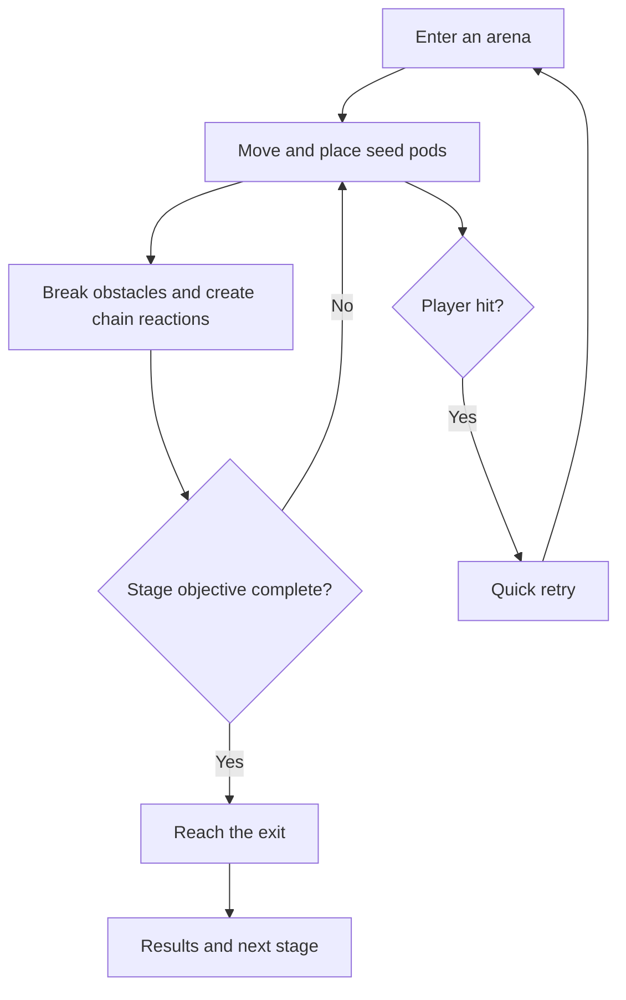
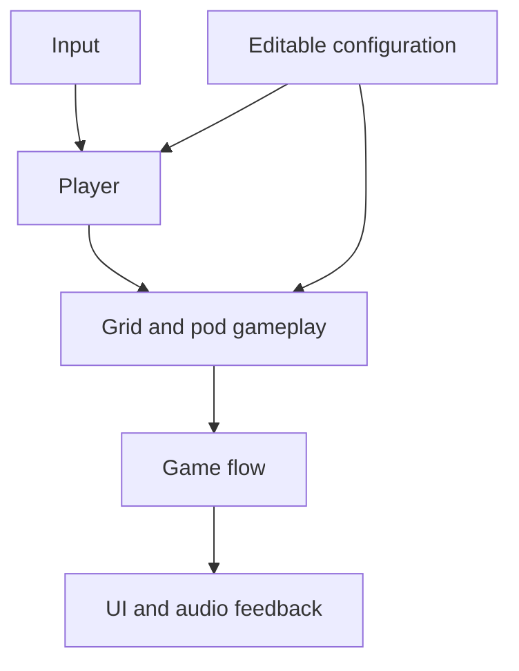

# BomberBird

## Game Design Document

| Field | Value |
|---|---|
| Status | Approved by the lecturer through the designated course GDD Google Sheet |
| Team | Roy Davidovich, game design and development |
| Genre | Single-player top-down grid action-puzzle |
| Target platform | Windows PC |
| Engine | Unity 6.3 LTS, 6000.3.21f1, 2D |
| Display | Landscape, 1920 x 1080 reference resolution |
| Expected session length | A few minutes per stage |
| Submission deadline | 4 October 2026 |
| Document version | v0.7, 2026-09-13 |

## 1. High Concept

BomberBird is a single-player action-puzzle game inspired by Bomberman. The player controls an Israeli bird defending local habitats from invasive common mynas in grid arenas, using timed seed pods that burst in four directions to clear obstacles, defeat enemies, and reach the exit. Each stage may also contain an optional bird rescue that rewards exploration without blocking progress.

### Design Pillars

1. **Readable chain reactions**: attacks follow simple grid, timing, and blocking rules.
2. **Israeli bird identity**: local birds defend recognizable habitats from invasive common mynas, giving the classic formula a distinct theme.
3. **Short handmade challenges**: every arena has a clear goal, quick retries, and room for playful level ideas.

## 2. Reference and Inspiration


- **Primary reference:** [Super Bomberman R](https://www.konami.com/games/asia/en/products/bomberman_r/).
- **Video:** [Official Konami gameplay trailer](https://www.youtube.com/watch?v=ZMuRtNADbpA).
- **Taking:** grid arenas, timed placement, cross-shaped attacks, destructible obstacles, and chain reactions.
- **Changing:** a single-player focus, Israeli birds defending local habitats from common mynas, original art, and seed-and-wind effects instead of traditional bombs.
- **Not taking:** Bomberman characters, assets, levels, competitive multiplayer, online systems, or a stage editor.

### Visual Direction

The intended style is colorful, readable, and viewed from above. Different stages can draw inspiration from Israeli environments such as wetlands, coast, desert, or urban gardens. Common mynas are the enemy birds and must remain visually distinct from playable and rescued birds. The exact art style, playable bird roster, palette, and effects will be explored during prototyping rather than fixed by this document.

## 3. Core Game Loop



### Moment-to-Moment Rules

- The bird moves in four directions through open corridors.
- The player places a timed seed pod on the grid.
- The pod bursts outward in four directions.
- Solid objects stop the burst. Some obstacles can be destroyed.
- A burst can trigger another pod and create a chain reaction.
- Common mynas act as the enemy birds. Their exact movement behavior will be selected during prototyping.
- The player loses a life when hit by a common myna, another hazard, or an active burst, then retries the stage immediately. The run ends when no lives remain.
- The stage objective is to defeat every common myna in the arena.
- On a regular stage, defeating the last myna makes a new bird's feather appear. The player must collect it, and only then does the exit open.
- The intro stage and the boss stage award no feather, so defeating the last myna opens their exit directly.
- Reaching an open exit completes the stage.
- An optional rescue may provide an additional stage reward.

### Progress and Scoring

A stage is complete when its main objective is cleared and the player reaches the exit. Optional goals, such as finding a rescued bird or meeting a time target, may award additional feathers. The precise rating rules will be tested during development and will not block basic progression.

### Campaign and Unlocks

The campaign is six handmade levels. Each level is themed around one bird and set in the habitat that bird belongs to, so every stage has its own visual identity rather than reskinning a single arena.

| Level | Habitat | Themed around |
|---|---|---|
| 1. Intro | Garden | Eurasian hoopoe, the starting bird |
| 2. Orchard | Orchard grove | Eurasian hoopoe |
| 3. Stream | Stream bank | White-throated kingfisher |
| 4. Lagoon | Lagoon shore | Great white pelican |
| 5. Upland | Rocky upland | Chukar partridge |
| 6. Boss | Overgrown courtyard | Common myna, as the boss |

A level that introduces a new bird drops that bird's feather into the arena once the last myna is defeated. Collecting it opens the exit and makes the bird playable from that point on. The player carries the growing roster forward and chooses from it at the start of later levels.

Four birds are playable: the Eurasian hoopoe, the white-throated kingfisher, the great white pelican, and the chukar partridge. The player starts as the hoopoe, so the intro level teaches the core rules with a character already in hand. The common myna is the enemy species and the final boss, and is never playable.

Exactly which level awards which feather is a pacing decision and will be settled during prototyping. The rule above holds regardless: a bird becomes playable by being discovered inside a level, never by being available from the start.

### Parameters to Tune

| Parameter | What it controls | First guess |
|---|---|---|
| Movement speed | Responsiveness and navigation | To be tested |
| Fuse duration | Time available to escape or prepare a chain | 2 seconds |
| Burst range | Area affected in each direction | 2 cells |
| Active pod limit | Number of simultaneous placed pods | 1 |
| Starting lives | Attempts before the run ends | 3 |
| Enemy speed | Pressure inside the arena | To be tested |

These values will be editable in the Unity Inspector or a configuration asset.

**Feel target:** a first-time player should understand the basic seed-pod interaction within the first stage and feel that failures were readable and avoidable.

## 4. Controls and Input

| Action | Keyboard | Gamepad | Touch |
|---|---|---|---|
| Move | WASD or arrow keys | Left stick or D-pad | Not planned |
| Place seed pod | Space | Main action button | Not planned |
| Confirm or retry | Enter or Space | Main action button | Not planned |
| Pause or back | Escape | Start or back button | Not planned |

Gameplay input is disabled while paused and during stage transitions. Losing focus pauses the game. Keyboard support is required; gamepad support is polish if time allows.

## 5. Screens and UI

1. **Main menu:** title, Play, and Quit.
2. **Bird selection:** available bird choices and Continue.
3. **Gameplay:** the arena and a compact HUD carrying the pods available to place, the current stage, and the lives remaining. A pod is spent when placed and returns to the player when it bursts, so the count refills on its own.
4. **Pause overlay:** Resume, Restart, and Main Menu.
5. **Results:** completion, optional rewards, Retry, and Next Stage.

```text
+----------------------------------------------------+
| Stage                                Pause          |
|                                                    |
|                 GAMEPLAY ARENA                     |
|                                                    |
| Pods available                            Lives    |
+----------------------------------------------------+
```

The final placement and visual treatment will be decided after the first playable arena. The Canvas will scale from a 1920 x 1080 reference resolution, and important information will not rely on color alone.

## 6. Art and Audio

| Asset group | Planned approach | License plan |
|---|---|---|
| Birds and portraits | Original or clearly licensed 2D art | Record creator, source, and license |
| Environments and obstacles | Original or clearly licensed tile art | Record creator, source, and license |
| Effects and UI | Original or clearly licensed assets | Record creator, source, and license |
| Sound and music | Original or clearly licensed audio | Record creator, source, and license |

Birds should be recognizable at gameplay scale. The approved playable roster is the Eurasian hoopoe, great white pelican, chukar partridge, and white-throated kingfisher. Their approved retro pixel-art concept sheets are stored in `Docs/ArtReferences/Birds/`. The common myna is the designated enemy species because it is an invasive species whose growing presence in Israel supports the game's local habitat-defense theme. The approved myna concept sheet represents the regular enemy. A larger boss myna closes the campaign in level 6; its exact design and attack behavior remain open. Ghost enemies are not part of the design. Other hazards, if used, will have fictional or abstract designs.

All imported assets will be listed in `Docs/ASSET_CREDITS.md` before submission. Art format, animation counts, and audio style will be chosen after a small visual prototype proves what is practical.

## 7. Technical Design

**Scenes:** a menu scene and one reusable gameplay scene are the current starting point. This may be simplified if a single-scene structure proves clearer.

**Systems:** Unity 2D, the built-in Input Manager, grid-based level data, and inspector-editable tuning values.

**Target device:** the Windows computer used for the class demonstration.



| Component | Responsibility |
|---|---|
| Game flow | Manage playing, pause, success, failure, and restart |
| Player | Movement and pod placement |
| Grid gameplay | Occupancy, bursts, obstacles, and chain reactions |
| Level data | Describe a handmade arena and its objective |
| UI and audio | Present feedback without deciding gameplay rules |

The exact class names and boundaries will be chosen while building the first vertical slice.

### Course Features

1. **Coroutine:** handle pod fuse timing and short transitions because both are time-based sequences.
2. **Object pool:** reuse frequently appearing pod or burst effects if profiling or repeated spawning justifies it.
3. **Events:** notify UI and audio about gameplay changes without coupling them directly to the player.
4. **ScriptableObject or serialized configuration:** expose values that need playtesting without recompiling code.

Only features that improve the actual implementation will remain. The architecture may change when the prototype provides better evidence.

## 8. Scope

### 8.1 MVP

- [ ] One complete loop from menu to playable stage, result, and retry.
- [ ] Four-direction movement in a grid arena.
- [ ] Timed pods, cross-shaped bursts, obstacles, and chain reactions.
- [ ] At least one clear common myna enemy behavior.
- [ ] A clear completion condition and exit.
- [ ] Six handmade levels, each in its own habitat, ending in the common myna boss level.
- [ ] Four playable birds unlocked in order by collecting a feather at the end of a level.
- [ ] Essential UI, feedback, and a working Windows build.

### 8.2 Polish

- [ ] Additional playable birds, habitats, stages, hazards, common myna behaviors, or optional rescues.
- [ ] A simple feather rating or collection screen.
- [ ] A small choice of gameplay modifiers built from existing values.
- [ ] Gamepad support and stronger visual or audio feedback.

### 8.3 Explicitly Out of Scope

- Multiplayer or networking.
- Procedural generation or a level editor.
- Mobile builds and touch controls.
- 3D environments or an open world.
- Large skill trees, complex narrative, or unique rule sets for every bird.
- Online accounts, leaderboards, or cloud saves.

## Approval Gate

The idea and this GDD were approved by the lecturer through the designated course GDD Google Sheet, so production may begin. The concept and scope may still change in response to lecturer feedback, and every approved change will be recorded in the changelog below.

## Changelog

| Version | Date | Change |
|---|---|---|
| v0.1 | 2026-09-05 | Initial proposal |
| v0.2 | 2026-09-05 | Replaced ghost enemies with invasive common mynas and aligned the theme, rules, art direction, and scope |
| v0.3 | 2026-09-08 | Confirmed the four playable bird species and preserved the approved retro concept references |
| v0.4 | 2026-09-11 | Pinned the exact Unity editor version required by the GDD template, and named the built-in Input Manager as the input system |
| v0.5 | 2026-09-11 | Recorded lecturer approval of the idea and GDD through the designated course Google Sheet, opening the approval gate |
| v0.6 | 2026-09-12 | Defined the six-level campaign, the feather unlock progression, and the four playable birds; confirmed the common myna as the boss and never playable; recorded the submission deadline |
| v0.7 | 2026-09-13 | Defined the stage objective as defeating every myna, turned the feather into a collectible that opens the exit on regular stages, added lives and the retry rule, and fixed the gameplay HUD to pods, stage, and lives |
