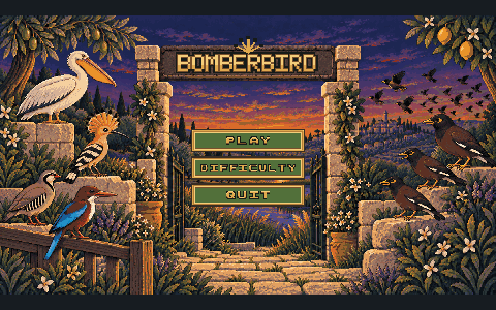
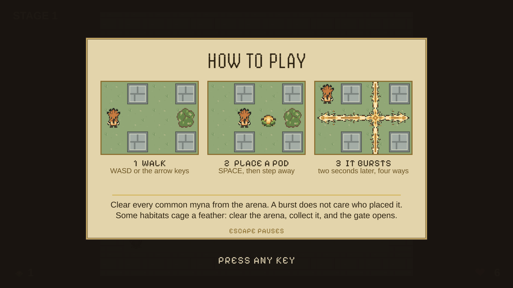
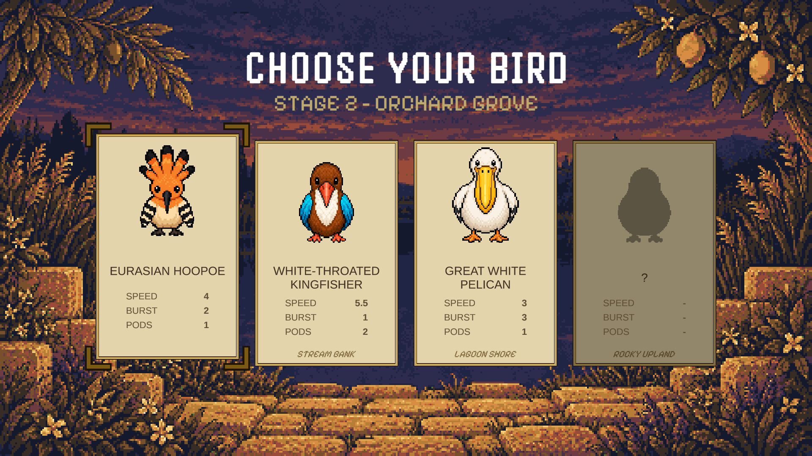
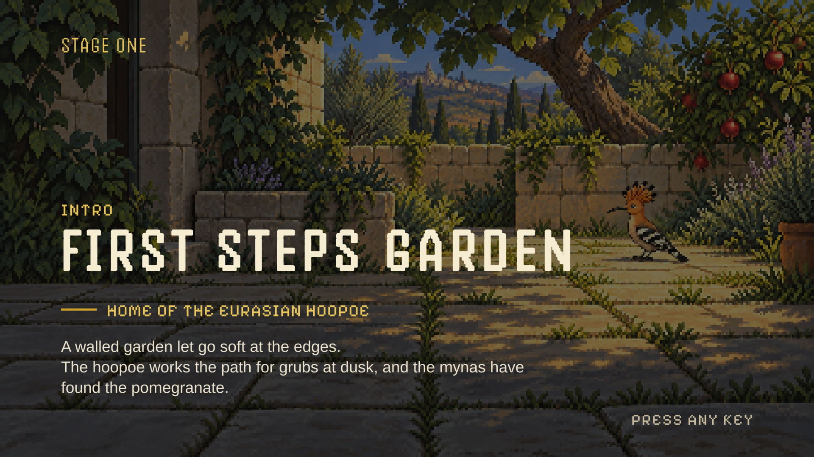
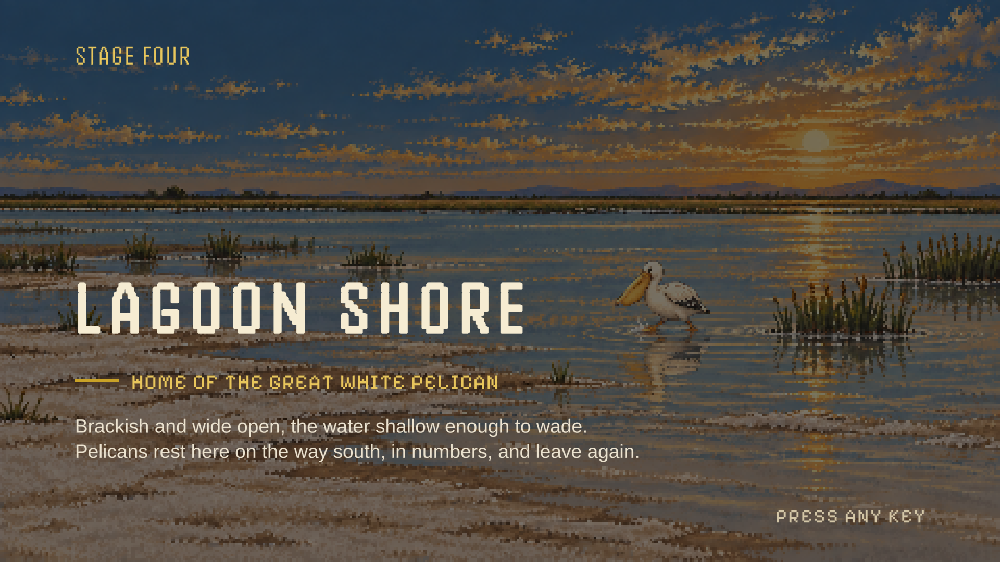
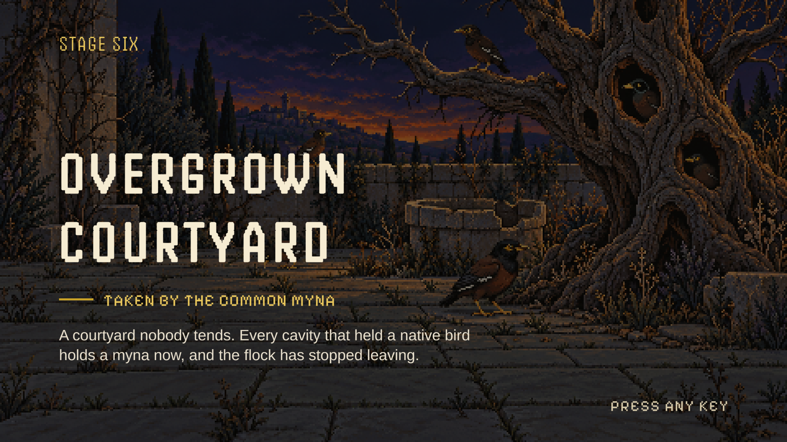

# BomberBird

BomberBird is a single-player reinterpretation of a classic grid action game, built for the
final project of an introductory Unity game development course. It takes Israeli birds and
habitats as its theme: the player controls a local bird defending its habitat from invasive
common mynas, moving through compact grid arenas and placing timed seed pods instead of
bombs to clear obstacles, defeat enemies, and reach the exit.

**Play it in the browser: [roydavidovich.itch.io/bomberbird](https://roydavidovich.itch.io/bomberbird)**

## How to play

Clear every common myna from the arena. A burst does not care who placed it, so the pod that
opens a path will take the bird that placed it just as readily. Some habitats cage a feather:
clear the arena, collect the feather, and the exit gate opens.

## The birds

Four native birds are playable. The hoopoe starts the campaign; the other three are earned by
collecting the feather their habitat awards.

| Bird | Speed | Burst | Pods | Unlocked by |
|---|---|---|---|---|
| [Eurasian hoopoe](Docs/ArtReferences/Birds/hoopoe-approved-concept.png) | 4 | 2 | 1 | the starting bird |
| [White-throated kingfisher](Docs/ArtReferences/Birds/white-throated-kingfisher-approved-concept.png) | 5.5 | 1 | 2 | the Stream Bank feather |
| [Great white pelican](Docs/ArtReferences/Birds/great-white-pelican-approved-concept.png) | 3 | 3 | 1 | the Lagoon Shore feather |
| [Chukar partridge](Docs/ArtReferences/Birds/chukar-partridge-approved-concept.png) | 4.5 | 2 | 2 | the Rocky Upland feather |

The enemy is the [common myna](Docs/ArtReferences/Birds/common-myna-approved-concept.png), an
invasive species that takes the nesting cavities the native birds depend on. A larger one holds
the final stage.

## The habitats

Six handmade stages, each its own habitat, each with its own tile set and its own painted
intro: First Steps Garden, Orchard Grove, Stream Bank, Lagoon Shore, Rocky Upland, and the
Overgrown Courtyard where the boss waits.

| | |
|---|---|
|  |  |

## Status

The campaign is playable end to end: six handmade stages, each in its own habitat, from the
garden intro to the common myna boss. The player starts as the hoopoe and earns the other
three birds by collecting the feather each habitat awards, and the run carries a menu, bird
selection, results, game over, and the two closing screens around them.

Remaining before submission: fresh macOS and Windows builds, each smoke-tested on its own
platform.

The full design is in [Docs/GDD.md](Docs/GDD.md); section 8 tracks what is built against what
is scoped.

## Controls

| Action | Keyboard |
|---|---|
| Move | WASD or arrow keys |
| Place seed pod | Space |
| Confirm or retry | Enter or Space |
| Pause or back | Escape |

## Documentation

- [Docs/GDD.md](Docs/GDD.md): Game Design Document, and the source of truth for behaviour and scope
- [Docs/ArenaGrid.md](Docs/ArenaGrid.md): how an arena is described, loaded, queried, and drawn
- [Docs/DEVELOPMENT_GUIDELINES.md](Docs/DEVELOPMENT_GUIDELINES.md): development and Git workflow rules
- [Docs/ASSET_CREDITS.md](Docs/ASSET_CREDITS.md): third-party asset sources and licenses
- [Docs/ArtReferences/Birds/](Docs/ArtReferences/Birds/): the approved concept sheets behind the bird sprites

Every asset in the game, original or third-party, is recorded with its source and licence in
[Docs/ASSET_CREDITS.md](Docs/ASSET_CREDITS.md).
